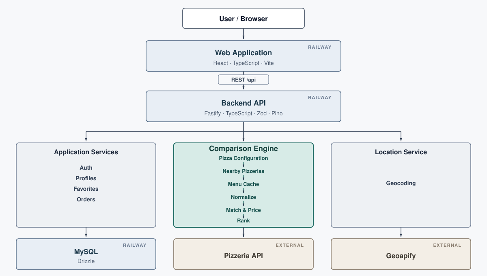

# PizzaWise

PizzaWise is a full-stack pizza comparison and ordering app. Build your pizza once, choose your location, and compare nearby pizzerias that can actually make it — ranked by price, distance, and delivery time.

The browser uses the PizzaWise backend, which integrates with the external Pizzeria API and Geoapify.

**Live demo:** [https://pizzawise-production.up.railway.app](https://pizzawise-production.up.railway.app)  
**User Guide:** [docs/user-guide.md](docs/user-guide.md)

## What it does

- Build a pizza (size, crust, sauce, toppings)
- Search an address or reverse-geocode the current location
- Rank nearby pizzerias that can make that pizza (price, distance, or ETA)
- Keep partial results when some menus fail
- Register / log in with server-side sessions
- User profiles, saved favorites, and order history
- English and Hebrew UI, with RTL for Hebrew

## Architecture



Same-origin `/api` is proxied to Fastify (Vite in development, nginx in Docker/Railway). Web, API, and MySQL are three Railway services. Pizzeria keys never leave the API process.

## How comparison works

`POST /api/pizzerias/compare`:

**Pizza Configuration → Location → Nearby Pizzerias → Menu Fetching → Normalization → Matching & Pricing → Ranking**

Menus go through the reliability layer (controlled upstream concurrency). Failed shops get a short recovery pass; still-failed shops become `uncheckedPizzeriaCount` instead of failing the request.

Provider labels become **semantic tags**; matching is tag-based. Prices are normalized to ILS minor units (cents or decimal upstream shapes).

Default ranking weights: price 0.4, ETA 0.35, distance 0.25. A selected `priority` raises that factor to 0.6. **Ranking uses the ETA range midpoint; the UI shows the min–max range.**

## Reliability

| Mechanism | Purpose |
| --- | --- |
| Retries | Retry retryable upstream errors (backoff / `Retry-After`) |
| Partial results | Rank shops that matched; count the rest as unchecked |
| Directory cache | Nearby pizzeria lookups, with stale-if-error |
| Menu cache | Pizzeria menus, with stale-if-error |
| Singleflight | One in-flight fetch per directory snapshot or pizzeria menu |
| Scheduler | Queue menu upstream work with controlled concurrency |
| Background warmer | Warm caches on startup and refresh them in the background |

Caches are **in-process**. They are not shared across API instances and reset on restart.

## Authentication & Data

Argon2id passwords. Server-side sessions use an httpOnly cookie. MySQL stores the **token hash**, not the token. No JWT in `localStorage`.

Favorites are named configurations (same tags as compare). `POST /api/orders` re-prices from the live menu and writes a `placed` snapshot.

Schema: `apps/api/src/db/schema.ts`. Migrations: `apps/api/drizzle/`. `DATABASE_URL` must be `mysql://` or `mysql2://`.

| Table | Role |
| --- | --- |
| `users` | Email + password hash |
| `sessions` | Token hash, expiry |
| `profiles` | Phone, default delivery address |
| `favorite_pizzas` / `favorite_pizza_toppings` | Saved configurations |
| `orders` / `order_toppings` | Local order snapshots |

## Localization

English and Hebrew from a message dictionary. Hebrew sets `dir="rtl"`. Locale is stored as `pizzawise.locale` in `localStorage`.

## Tech Stack

| Area | Technology | Reason |
| --- | --- | --- |
| Monorepo | pnpm workspaces | Shared pizza/menu types |
| Web | React, TypeScript, Vite, React Router | SPA + static nginx build |
| API | Fastify 5, TypeScript | Small Node API, Pino logs |
| Upstream parsing | Zod | Reject malformed vendor JSON |
| Auth | Argon2id + httpOnly cookie | Server-side sessions |
| Data | MySQL, Drizzle | Typed schema and SQL migrations |
| Edge | nginx | SPA + `/api` proxy, no browser secrets |

## Running Locally

Requires Node.js `>= 22.12.0` and pnpm `11.25.0` (Corepack). MySQL must already be running. `docker-compose.yml` does not start a database.

```bash
corepack enable
pnpm install
cp apps/api/.env.example apps/api/.env
pnpm --filter @pizzawise/api db:migrate
pnpm dev
```

Vite proxies `/api` to `http://127.0.0.1:3000`.

The app is typically at `http://127.0.0.1:5173`.

## Environment

| Variable | Used by | Purpose |
| --- | --- | --- |
| `DATABASE_URL` | API | MySQL connection |
| `PIZZERIA_API_BASE_URL` | API | Pizzeria directory/menus |
| `PIZZERIA_API_KEY` | API | Pizzeria auth |
| `GEOAPIFY_API_KEY` | API | Geocoding |
| `API_UPSTREAM` | Web (nginx) | Reachable Fastify origin for `/api` |
| `PORT` | API / web images | Listen port (API image default 3000) |
| `LOG_LEVEL` | API | Pino level (default `info`) |

Do not put Pizzeria or Geoapify keys in the web app.

## Testing

No separate `typecheck` script; `tsc` runs in API tests and in `build`.

```bash
pnpm test
pnpm build
pnpm --filter @pizzawise/api test
pnpm --filter @pizzawise/web test
pnpm --filter @pizzawise/web lint
```

## Docker & Deployment

```bash
docker compose up --build
```

Compose builds API (`:3000`) and web/nginx (`:8080` with `API_UPSTREAM=http://api:3000`). It does not run MySQL.

**Docker and Railway API startup do not run migrations.** Apply them as a setup step (`pnpm --filter @pizzawise/api db:migrate`) before relying on auth, favorites, or orders.

Railway is three services: MySQL, API (`apps/api/Dockerfile`, listen `0.0.0.0`), web (`apps/web/Dockerfile`). `API_UPSTREAM` must be a **reachable API origin**. Keep Pizzeria keys on the API service only.

## Observability

`GET /health` pings MySQL → `{ "status": "ok" }` or `503` `{ "status": "unhealthy" }`. Fastify/Pino logs request ids (`x-request-id` or generated `reqId`). Cookies, passwords, API keys, and session tokens are redacted.

## Key Design Decisions

| Decision | Reason |
| --- | --- |
| Browser never calls the Pizzeria API | Keys, ranking, and retries stay on the API |
| Semantic tags, not raw labels | Shop names for the same option differ |
| Partial compare results | One 429 should not empty the list |
| In-process cache + warmer | Fits one API instance; no Redis |
| Controlled upstream concurrency + recovery | Protect the upstream while recovering individual failures |
| Local order snapshots | No payment/order vendor in the assignment |
| Cookie sessions | Same-origin proxy; no token in JS storage |

## Limitations

- In-process caches do not span replicas and go cold on restart
- Compose does not provision MySQL
- Orders do not charge or notify a shop
- Upstream rate limits still apply
- Locales are EN/HE only
